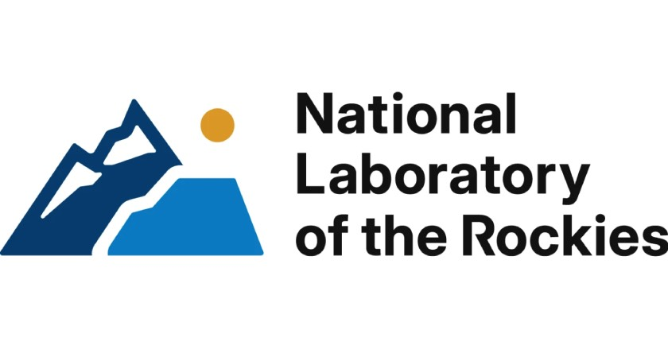

# 3 — SDOM Single Run, Outputs, and Default Plots

This module runs SDOM end-to-end on `data/sample_data/`, exports results,
generates default plots, and explores key fields of `OptimizationResults`.

## Learning objectives

- Build and solve an SDOM model using the public API.
- Use `n_hours=1440` for a practical training horizon.
- Check solve success before post-processing.
- Export CSV outputs and generate default plots.

## Prerequisites

- You completed modules 1 and 2.
- Your environment has `sdom` and a solver (HiGHS recommended for this module).

## Inputs and scenario used

- Scenario folder: `data/sample_data/`
- Time horizon: 1440 time steps
- Solver: HiGHS (`solver_name="highs"`)

Reference:
- Running SDOM and outputs: <https://natlabrockies.github.io/SDOM/user_guide/running_and_outputs.html>

## Project/file structure for this module

```text
training/3_sdom_single_run/
├── README.md
└── run.py
```

## Step-by-step walkthrough

1. Run the script:

   ```powershell
   python training/3_sdom_single_run/run.py
   ```

2. Inspect terminal output for:
   - Solver status and termination condition.
   - Total cost and selected capacity metrics.

3. Inspect output artifacts under:

   ```text
   results/training/3_sdom_single_run/
   ```

## Full runnable script

See [training/3_sdom_single_run/run.py](run.py).

## Expected outputs

- Exported CSV files for the solved case.
- Default SDOM plots generated via `plot_results`.
- Console summary of key `OptimizationResults` fields.

## How to validate results

- `solver_status == "ok"`
- `termination_condition == "optimal"`
- Output directory contains CSVs and figures.

## Troubleshooting

- Solver error: ensure `highspy` is installed in `.venv`.
- Non-optimal termination: reduce horizon for smoke tests, check data quality.
- Missing output files: confirm script completed after `export_results` and `plot_results`.

## References

- SDOM docs home: <https://natlabrockies.github.io/SDOM/index.html>
- API core: <https://natlabrockies.github.io/SDOM/api/core.html>
- API results: <https://natlabrockies.github.io/SDOM/api/results.html>
- Running and outputs: <https://natlabrockies.github.io/SDOM/user_guide/running_and_outputs.html>
